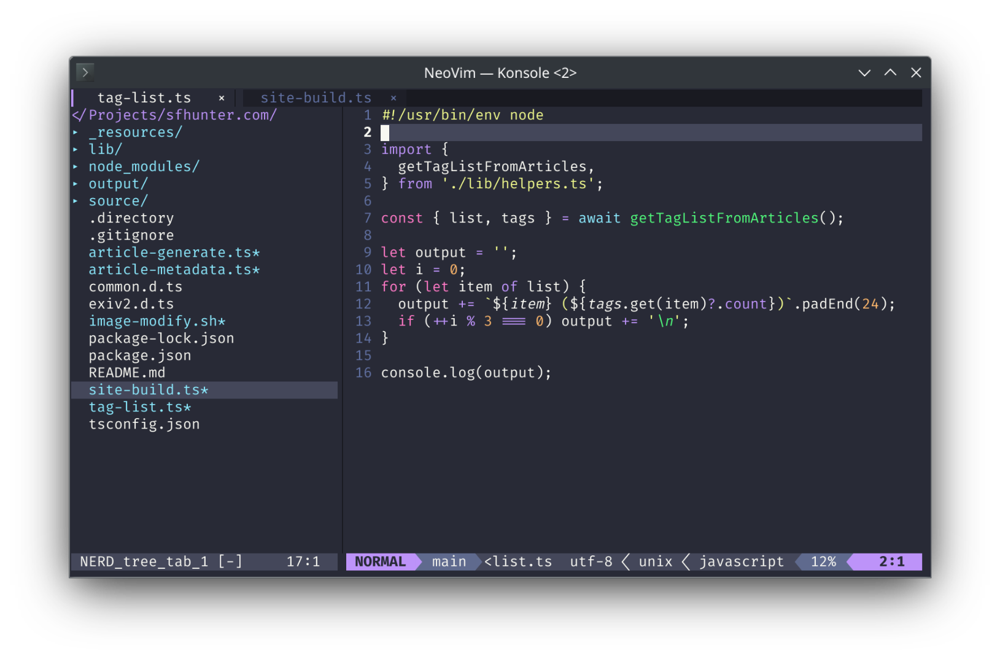

# ~/.config/nvim/init.lua



This Neovim configuration is meant to make Neovim feel more like an IDE than a simple console-based text editor.
It's written in Lua and targets Neovim only.

## Installation

### Clone with GIT

Run these commands to get this configuration working on your OS X or Linux machine.
You can run `git pull` inside of `~/.config/nvim` if you'd ever like to grab the latest version.

```bash
mkdir -p ~/.config
git clone git@github.com:tlhunter/vimrc.git ~/.config/nvim
```

### One Time Download

This method might be more sane. Simply download the latest version, extract to `~/.config/nvim`, and configure to your liking.

```bash
# TODO: wrong branch
wget https://github.com/tlhunter/vimrc/archive/master.zip
```


## Features and Philosophy

* Edit many files at the same time
* File Browser on left panel
* Move between files in right panel
* View status of the current GIT repo, if applicable
* Quickly navigate to files using a fuzzy finder

### Leader Key

- Space

### Switching between files (Buffers)

* Use `<Leader>q` to close the current file (a different file will appear in its place)
* Use `Ctrl h` and `Ctrl l` to cycle between open files

### Viewports (Windows/Splits)

* Use `<Leader>h` `<Leader>j` `<Leader>k` `<Leader>l` to navigate between viewports
* Use `<Leader>Q` to close the current window (you probably won't ever need to do this)
* Use `<Leader>n` to toggle the file browser
* Use `<Leader>m` to focus on the file browser
* Use `<Leader>M` to focus on the current file in the file browser
* Use `Ctrl P` to perform a recursive fuzzy filename search
* Use `<Leader>a` and type a phrase to search within file contents

### File Browser (NERDTree)

* Use `<Leader>n` to toggle the file browser
* Use standard movement keys to move around
* Use `Ctrl j` and `Ctrl k` to move between siblings (aka skip over children in expanded folders)
* Use `C` to make the highlighted node the current working directory
* Use `:Bookmark BookmarkName` to bookmark the current selection
* Use `B` to toggle the bookmark menu
* Use `?` if you'd like some NERDTree documentation
* Use `o` to open the selected file in a new buffer
* Use `t` to open the selected file in a new tab

## TODO / Known Bugs

* Can't horizontally scroll using trackpad (Linux + KDE + Wayland + Konsole + NeoVim)
* **Nerdtree**
  * Opening a large directory in NerdTree results in a slow session until NeoVim is killed
  * If NerdTree is focused and you use `<Leader>a` and open an entry it opens in the NerdTree window
    * Basically there are many ways to clobber the NerdTree split
  * The status bar at the bottom doesn't contain useful information
  * Ideally the bufferline would not be above NerdTree
* **Telescope**
  * Make the find input box appear above the results list
  * Reverse the results list so the most relevant entry is first not last, go down for second most relevant not up
